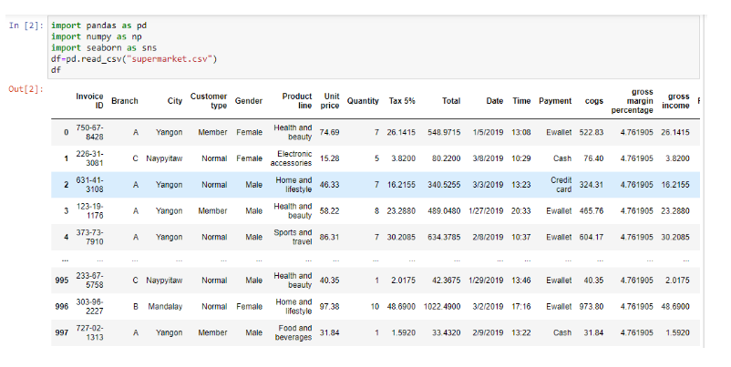
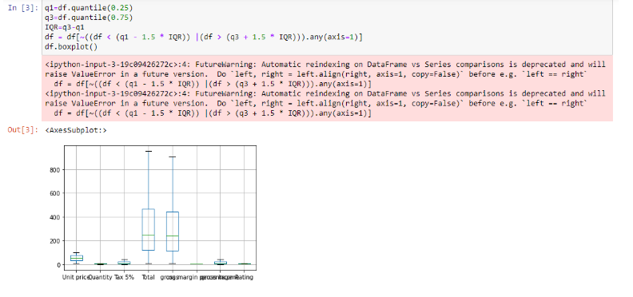
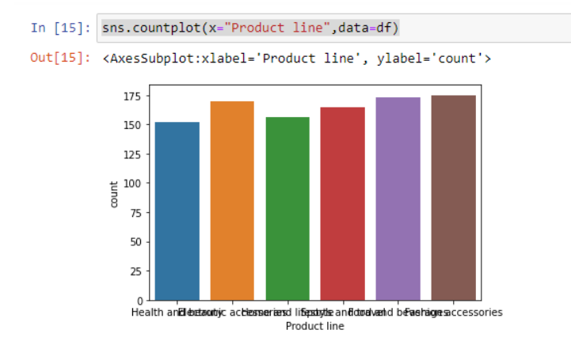
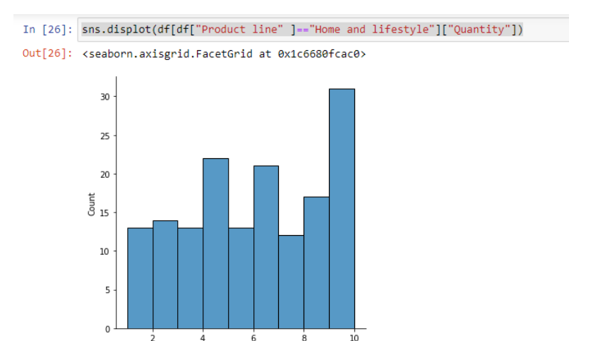
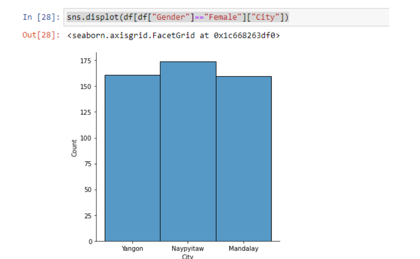
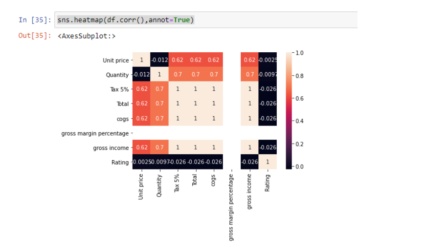

# Ex-04-EDA

## AIM
To perform EDA on the given data set.

## EXPLANATION
The primary aim with exploratory analysis is to examine the data for distribution, outliers and anomalies to direct specific testing of your hypothesis.

## ALGORITHM:
### STEP 1
Import the required packages(pandas,numpy,seaborn).

### STEP 2
Read and Load the Dataset

### STEP 3
As the first step remove the null values from the dataframe

### STEP 4
Return the objects containing counts of unique values using (value_counts()).

### STEP 5
Plot the counts in the form of Histogram or Bar Graph.

### STEP 6
Find the pairwise correlation of all columns in the dataframe.corr() and save the cleaned data to the file

## CODE
```
import pandas as pd
import numpy as np
import seaborn as sns
df=pd.read_csv("supermarket.csv")
df
df.info()
df.isnull().sum()
df.boxplot()
q1=df.quantile(0.25)
q3=df.quantile(0.75)
IQR=q3-q1
df = df[~((df < (q1 - 1.5 * IQR)) |(df > (q3 + 1.5 * IQR))).any(axis=1)]
df.boxplot()
df["City"].value_counts()
df["Gender"].value_counts()
df["Customer type"].value_counts()
df["Product line"].value_counts()
df["Payment"].value_counts()
df["Branch"].value_counts()
sns.countplot(x="Gender",data=df)
sns.countplot(x="City",hue="Product line",data=df)
sns.countplot(x="Product line",hue="City",data=df)
sns.countplot(x="Branch",hue="Gender",data=df)
sns.countplot(x="City",data=df)
sns.countplot(x="Product line",data=df)
sns.countplot(x="Quantity",data=df)
sns.countplot(x="Time",data=df)
sns.countplot(x="City",hue="Payment",data=df)
sns.displot(df[df["Branch"]=="C"]["Payment"])
sns.displot(df[df["Product line" ]=="Home and lifestyle"]["Quantity"])
sns.displot(df[df["Payment"]=="Ewallet"]["City"])
sns.displot(df[df["Gender"]=="Female"]["City"])
sns.displot(df[df["Product line"]=="Home and lifestyle"]["Rating"])
pd.crosstab(df["Gender"],df["Branch"])
pd.crosstab(df["Branch"],df["Product line"])
pd.crosstab(df["Product line"],df["City"])
df.corr()
sns.heatmap(df.corr(),annot=True)
```

## OUTPUT











## RESULT
EDA on the given data set is performed successfully.